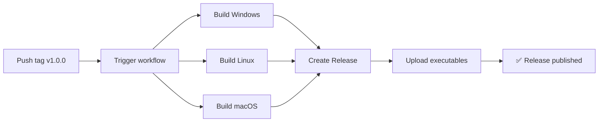

# 🚀 Guide de Release - Star Citizen Cargo Share

Guide complet pour créer et publier une nouvelle version de l'application.

## 📋 Processus automatique (GitHub Actions)

Le workflow GitHub Actions génère **automatiquement** les exécutables pour Windows, Linux et macOS dès que vous créez un tag de version.

### 🎯 Créer une nouvelle release (3 étapes simples)

#### Étape 1 : Préparer le code

Assurez-vous que tout est prêt :
```bash
# Vérifier que tout est à jour
git status

# Si des modifications existent, les committer
git add .
git commit -m "Prepare for release v1.0.0"
git push
```

#### Étape 2 : Créer et pousser le tag

```bash
# Créer le tag de version (format: v1.0.0, v1.2.3, etc.)
git tag v1.0.0

# Pousser le tag vers GitHub
git push origin v1.0.0
```

#### Étape 3 : Attendre la magie ✨

C'est tout ! GitHub Actions va automatiquement :

1. ⚙️ **Builder** les exécutables pour Windows, Linux, macOS
2. 📦 **Créer** une nouvelle GitHub Release
3. 📤 **Uploader** les 3 exécutables
4. 📝 **Générer** les release notes automatiquement

⏱️ **Durée** : ~5-10 minutes

### 📊 Suivre le build

1. Allez sur GitHub → votre repository
2. Cliquez sur **"Actions"**
3. Vous verrez le workflow **"🚀 Build and Release"** en cours
4. Cliquez dessus pour voir les détails en temps réel

### 🎉 Récupérer la release

Une fois terminé :

1. Allez sur **"Releases"** (à droite sur GitHub)
2. Votre nouvelle version apparaît avec :
   - `StarCitizenCargoShare-Windows.exe`
   - `StarCitizenCargoShare-Linux`
   - `StarCitizenCargoShare-macOS`

## 📝 Conventions de versioning

Utilisez le **Semantic Versioning** (SemVer) : `vMAJOR.MINOR.PATCH`

- **MAJOR** (v2.0.0) : Changements incompatibles
- **MINOR** (v1.1.0) : Nouvelles fonctionnalités compatibles
- **PATCH** (v1.0.1) : Corrections de bugs

### Exemples

```bash
# Première release
git tag v1.0.0

# Ajout de fonctionnalités
git tag v1.1.0

# Correction de bugs
git tag v1.0.1

# Changement majeur
git tag v2.0.0
```

## 🔧 Personnaliser les release notes

Les release notes sont générées automatiquement par le workflow. Pour les personnaliser :

1. Éditez `.github/workflows/release.yml`
2. Modifiez la section **"Generate release notes"**
3. Committez et poussez avant de créer le tag

## 🐛 Dépannage

### Le workflow ne se déclenche pas

**Problème** : Vous avez poussé le tag mais rien ne se passe

**Solution** :
```bash
# Vérifier que le tag suit le format v*.*.*
git tag  # Liste tous les tags

# Vérifier que le tag a été poussé
git ls-remote --tags origin

# Re-pousser si nécessaire
git push origin v1.0.0
```

### Le build échoue

**Problème** : Le workflow échoue lors du build

**Solution** :
1. Allez dans **Actions** → cliquez sur le workflow échoué
2. Regardez les logs pour identifier l'erreur
3. Corrigez le problème
4. Supprimez le tag défectueux :
   ```bash
   git tag -d v1.0.0
   git push origin :refs/tags/v1.0.0
   ```
5. Recréez le tag après correction

### Modifier une release existante

**Problème** : Vous voulez modifier une release déjà publiée

**Solution** :
1. Allez sur GitHub → **Releases**
2. Cliquez sur **"Edit"** sur la release
3. Modifiez le titre, la description, ou uploadez de nouveaux fichiers
4. Sauvegardez

Ou supprimez et recréez :
```bash
# Supprimer le tag local et distant
git tag -d v1.0.0
git push origin :refs/tags/v1.0.0

# Recréer
git tag v1.0.0
git push origin v1.0.0
```

## 📦 Build manuel (optionnel)

Si vous voulez builder localement sans GitHub Actions :

### Windows
```cmd
build.bat
```

### Linux/macOS
```bash
./build.sh
```

Les exécutables seront dans `dist/`

## 🔐 Sécurité

- Le workflow utilise `GITHUB_TOKEN` automatiquement fourni par GitHub
- Pas besoin de créer de token personnel
- Les permissions sont limitées à `contents: write`

## 📈 Workflow détaillé



## 🎯 Checklist avant release

- [ ] Code testé et fonctionnel
- [ ] README.md à jour
- [ ] Version incrémentée dans le tag
- [ ] Changelog préparé (optionnel)
- [ ] Tous les fichiers committés
- [ ] Tag créé avec le bon format `v*.*.*`
- [ ] Tag poussé vers GitHub

## 🌐 URLs utiles

- **Actions** : `https://github.com/PriamK/star-citizen-cargo-share/actions`
- **Releases** : `https://github.com/PriamK/star-citizen-cargo-share/releases`
- **Tags** : `https://github.com/PriamK/star-citizen-cargo-share/tags`

---

**⬢ Prêt pour la release ! See you in the 'verse! 🚀**
